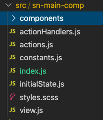
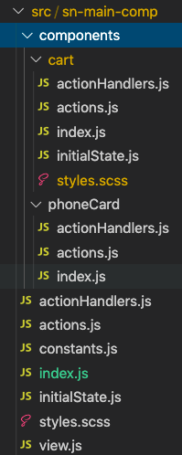
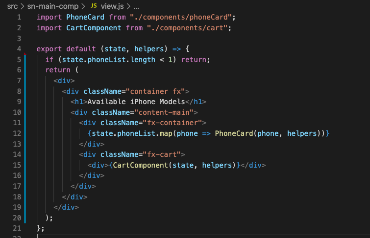
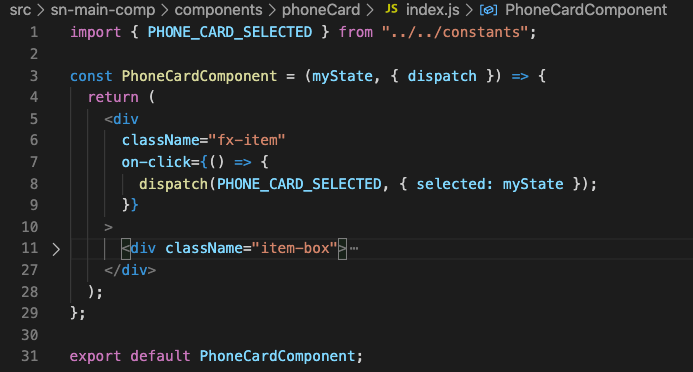

# Functions instead of Components ( aka Seismic or UI Framework components)

Are you making a web component (Seismic or UI Framework component) and planning to write sub components within it? You may not need sub components. You may just need a simple function instead that can act as a component. Let's see how.

## What are these Functions acting as components?

In simple terms, they are merely pure functions which return bunch of JSX to render. But if you follow coding best practices, you can make a Function which looks and feels exactly like an actual component, just stateless (what?).

## But why do I need a Function if I can simply write a UI Framework component (or web component)?

There are actually lots of good reasons to use Functions as sub-components inside your main (outer) component.

1. These Functions are much easier to read and test because they are plain JavaScript functions without state or lifecycle-hooks.
2. They do not update Seismic Component Registry. No duplications.
3. Avoid custom tag name collisions when using your component with third party components.
4. No overhead of store maintenance as they are stateless. They share parent component's state.
5. Better performance as they result in low code and faster bundles.
6. Better organised component code and increased readability.
7. Helps minimise custom tags that browsers need to maintain.

## How do I know whether I need a Function OR UI Framework component?

It's simple, ask yourself couple of below questions. If answers to them is NO, you should probably use a Function as component.

1. Is my sub component re-usable outside of my main UI Framework component?
2. Does my sub component needs to maintain its own state and I absolutely cannot use parent component's state?

## All right, I am onboard. But how do I write a Function that acts as a component?

Please refer to this repo for example of Functions.

You can see the main component here is 'sn-main-comp' which will be the one that will be published in the UI Framework (Seismic) component registry. This is the name which other people will use for your component.

The main component has its own actions, actionHandlers, view, styles and state files.

Now let's see how Functions can be organised to act as components.

I have two sub components here. Both of these components have real meaning only inside my main component (sn-main-comp) and I don't intent them to be used outside on their own. Hence I have made them as Functions.

You will notice that both the sub components have their own folder to contain the related code. All the actions, actionHandlers, view, styles and state that are related to each of them have been separated out in respective folders.

To invoke these Functions from main component, this is what you need to do in main component's view.

Notice the 'PhoneCard' and 'CardComponent' Functions. Thats it!

And this is what I have in one of the components index.js file.

No 'createCustomElement' used to create component.

As you can see using Functions as components we can cleanly breakdown the functionalities into pure functions without any need to create new UI Framework components. This also increases code readability and makes debugging easier. These can be easily unit tested as well.

P.S. These Functions are not really a component. I am just saying you can make them feel like one. Ha! (As Mr. Calvin Harris has said "Don't be afraid to catch feels")

DISCLAIMER: We always advocate reusability first. If you use functions, your team is responsible for maintaining this code forever. If there is an existing component that can be reused you are better off using that and adding new features to support your use cases directly to it instead of creating yet another duplicate. This way you will get updates "for free" going forward as the design system evolves over time. No pressure.
